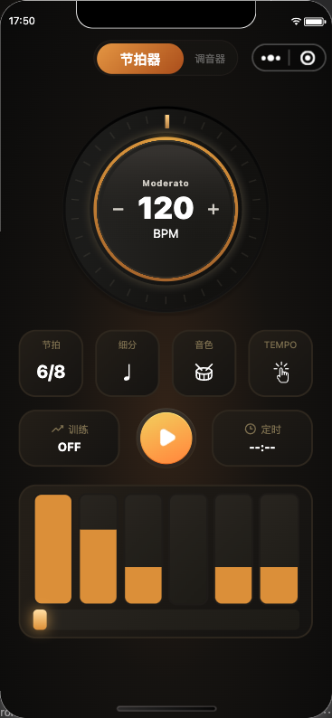
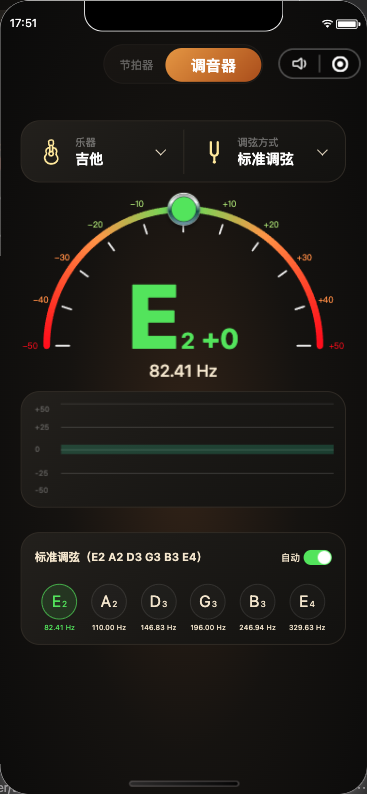

# ToneCraft

ToneCraft 微信小程序源码及配套公开页面。

## 仓库结构

- [`wechat-miniprogram/`](wechat-miniprogram/)：微信小程序源码、测试和开发配置。
- [`docs/`](docs/)：GitHub Pages 发布的公开页面和法律页面。

## 微信小程序

在微信开发者工具中导入 [`wechat-miniprogram/`](wechat-miniprogram/) 目录。进入该目录后可以运行：

```bash
npm install
npm run typecheck
npm test
```

可直接在微信中搜索“**音匠节拍器**”或“**音匠调音器**”使用。

### 页面预览





## 公开页面

- [隐私政策](https://hitout.github.io/ToneCraft/privacy-policy/)
- [Privacy Policy](https://hitout.github.io/ToneCraft/privacy-policy/en/)
- [用户协议](https://hitout.github.io/ToneCraft/user-agreement/)
- [User Agreement](https://hitout.github.io/ToneCraft/user-agreement/en/)

## 许可证

本项目的微信小程序源码、测试和配置文件采用 Apache-2.0。原始图标、未授权视觉素材、ToneCraft 品牌与商标以及 `docs/` 法律页面不在授权范围内。运行前请按 [`wechat-miniprogram/README.md`](wechat-miniprogram/README.md) 准备本地图标目录，详细范围见 [`LICENSE-SCOPE.md`](LICENSE-SCOPE.md)。
